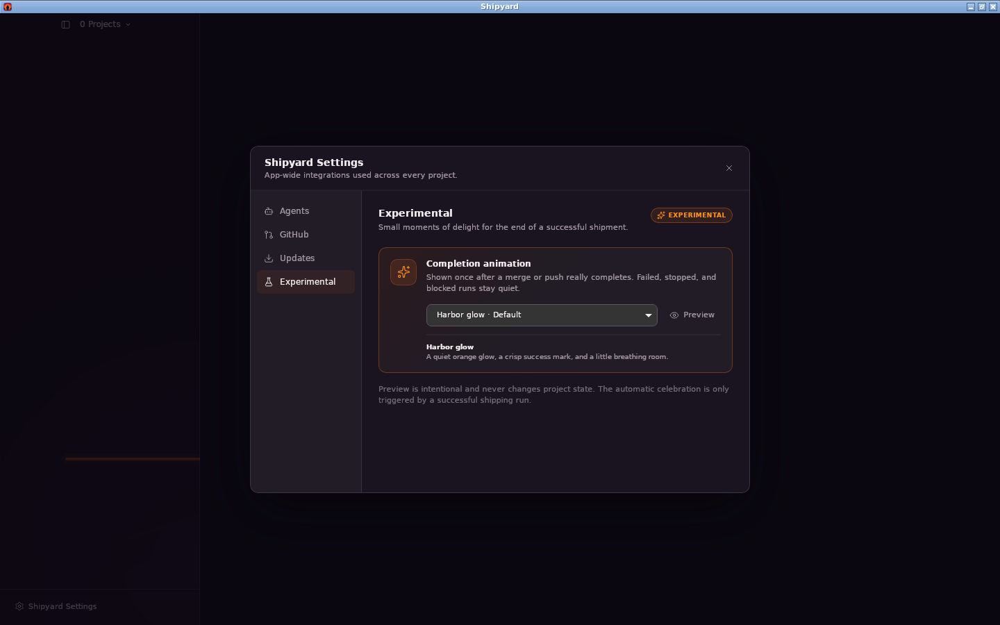
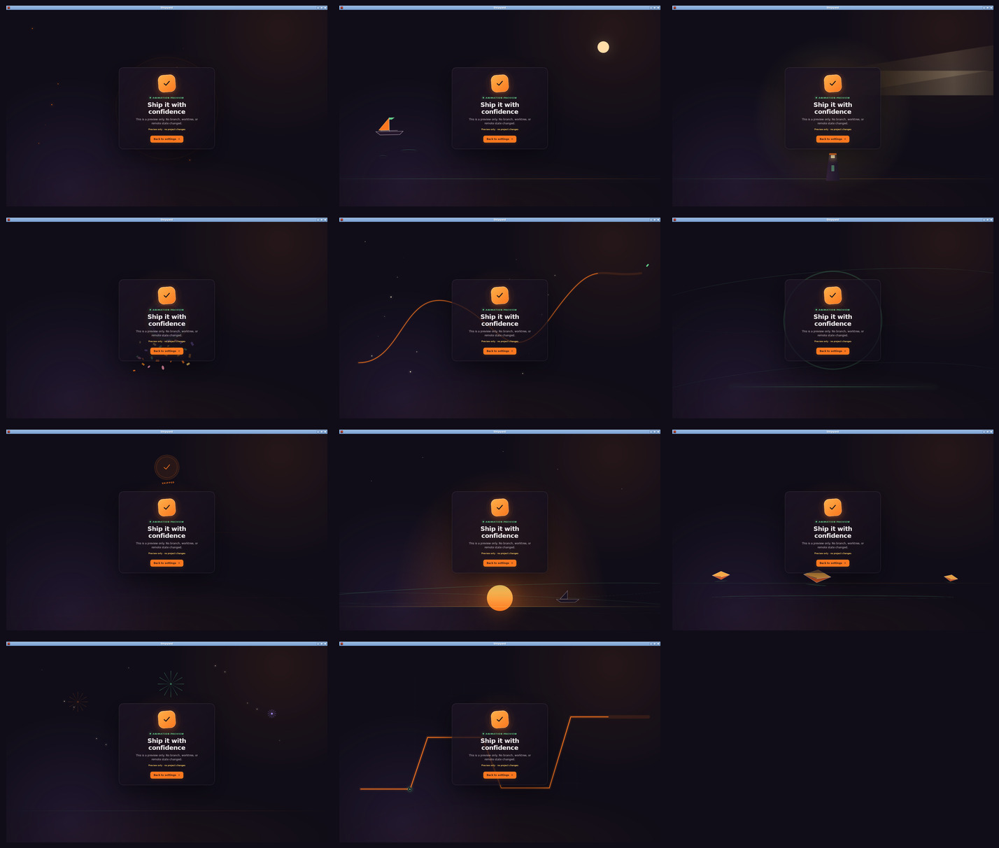

# Shipping completion review

The review captures below were taken from the running ShipYard Tauri app on the virtual desktop.

To exercise the feature, open **Shipyard Settings → Experimental**, choose an option from
**Completion animation**, and select **Preview**. The 11 choices are:

1. Harbor glow (default)
2. Sail away
3. Lighthouse beam
4. Confetti burst
5. Constellation route
6. Tidal rings
7. Dock stamp
8. Sunrise
9. Paper fleet
10. Firework sky
11. Signal path

Preview never changes project state. The automatic celebration is shown only after a shipping
run exits successfully; failed, cancelled, blocked, and ordinary script runs stay quiet.
